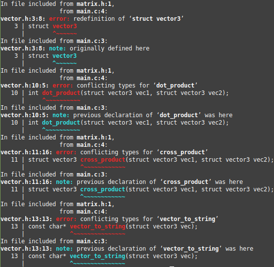
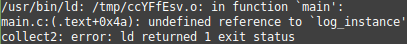
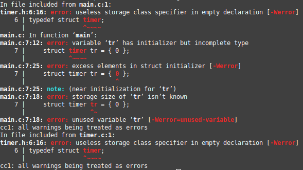

# Conceptos-Varios-de-C
Rejunte de varios conceptos de C.

## Prerequisitos.
Para poder compilar los ejemplos, se necesita de dos cosas:
  * Cualquier editor de texto.
  * El compilador gcc (que viene por defecto en linux).

## Indice

* El proceso de compilación.
* El preprocesador.
* Declaración vs Definición.
* Header Files y Guards.
* Scope y visibilidad.
* Punteros.
* Declaraciones adelantadas.

## El proceso de compilación

A la hora de compilar un programa en C, podemos distinguir dos etapas. La etapa de **compilación** y la etapa de **linkeo**. Para ver como funciona, vamos a hacer un ejemplo. Supongamos que tenemos los siguientes archivos de C:

`functions.c`
``` C
  int sum(int a, int b) { return a + b; }
  
  int sub(int a, int b) { return a - b; }
  
  int mult(int a, int b) { return a * b; }
  
  int div(int a, int b) { return a / b; }
```

`main.c`
``` C
#include <stdio.h>

int sum(int a, int b);
int sub(int a, int b);
int mult(int a, int b);
int div(int a, int b);

int main(void)
{
  int num1;
  int num2;
  
  int sum_result;
  int sub_result;
  int mult_result;
  int div_result;
  
  printf("Enter num1: ");
  scanf("%d", &num1);
  printf("Enter num2: ");
  scanf("%d", &num2);
  
  sum_result = sum(num1, num2);
  sub_result = sub(num1, num2);
  mult_result = mult(num1, num2);
  div_result = div(num1, num2);

  printf("The sum of num1 and num2 is: %d\n", sum_result);
  printf("The sub of num1 and num2 is: %d\n", sub_result);
  printf("The mult of num1 and num2 is: %d\n", mult_result);
  printf("The div of num1 and num2 is: %d\n", div_result);

  return 0;
}
```
El programa lee dos numeros que ingresa el usuario por consola y muestra el resultado por consola. Una vez que tenemos escrito los archivos, ejecutamos: `gcc -c functions.c main.c` y luego `gcc -o main functions.o main.o`. Para ejecutar el programa, simplemente hacemos `./main`

#### ¿Como funciona?

En **functions.c** tenemos _definidas_ un par de funciones que realizan operaciones básicas, mientras que en el archivo **main.c** esta el programa principal donde usamos estas funciones. Antes de la función `main` tenemos las _declaraciones_ de las funciones que se encuentran en el archivo **functions.c**. Esto le dice al compilador que las _definiciones_ de esas funciones existen en algun otro archivo _.c_. Mas adelante vamos a ver en mas profundidad el tema de las _declaraciones_ y las _definiciones_. Como dijimos al principio, el proceso de compilación esta separado en dos etapas: la **fase de compilación** y la **fase de linkeo**.

En la **fase de compilación** entra en juego el compilador de C, que analiza cada uno de los archivos _.c_ que nosotros le especifiquemos, genera código assembler y, luego, código máquina. Los archivos generados por la fase de compilación se los conoce como _archivos objetos_. Estos tienen extension _.o_, y son el resultado de la traducción que hace el compilador. Cada uno de estos archivos _.o_ contiene instrucciones máquina que el procesador puede interpretar. Estos archivos los generamos con el primer comando `gcc -c functions.c main.c`.

Luego, en la **fase de linkeo**, el linker se encarga de agarrar todos estos _archivos objeto_ y combinarlos en un solo ejecutable (o libreria en caso de que se este armando una). El linker tambien se encarga de resolver las llamadas a funciones. Es decir, el linker analiza cada uno de los archivos _.o_ y cuando encuentra una llamada a una función, busca si existe una _definición_ de esa función entre todos los archivos _.o_ que tiene. En nuestro ejemplo, cuando el linker analiza nuestro **main.o**, encuentra las llamadas a funciones de `sum`, `sub`, `mult` y `div` y busca las _definiciones_ de estas funciones dentro de **main.o** y en los otros archivos _.o_ (en nuestro caso, **functions.o**). Si, por ejemplo, no hubiermos compilado el archivo **fucntions.c**, podríamos haber compilado sin problemas el archivo **main.c**, pero el linker no hubiera encontrado las definiciones de las funcioes antes mencionadas, y obtendríamos un error de linkeo. El linker se ejecuta con el segundo comando `gcc -o main functions.o main.o`.

__*nota*__: _podríamos haber generado el ejecutable simpelmente haciendo `gcc -o main main.c functions.c` directamente. Las ventajas obvias son que no generamos archivos extras en nuestro directorio, y son menos comandos que ejecutar. Pero la idea es entender, a grandes rasgos, las etapas del compilador. Ademas, la mayoria de los IDEs generan estos archivos. La idea de generar estos archivos intermedios es que, si nosotros modificamos un archivo en nuestro proyecto  y no generamos los archivos intermedios .o, deberiamos recompilar todos los archivos nuevamente. En cambio, si generamos los archivos objetos, solo tendriamos que recompilar el archivo que modificamos y linkiear nuevamente._

## El preprocesador

Existe una fase previa a las anteriores mensionadas. La **fase de preprocesador**. En esta fase, el preprocesador de C se encarga de analizar las directivas de preprocesador como son los `#include`, `#defines`, `#ifdef`, etc. Una lista de las directivas de C se puede encontrar [en esta página](https://en.wikibooks.org/wiki/C_Programming/Preprocessor_directives_and_macros). El siguiente ejemplo muestra como funcionan las directivas `#include` y `#define`:

`op.c`
``` C
int sum(int a, int b) { return a + b; }

int sub(int a, int b) { return a - b; }

int mult(int a, int b) { return a * b; }

int div(int a, int b) { return a / b; }
```

`main.c`
``` C
#include "op.c"

int main(void)
{
 int a = 2;
 int b = 3;
 
 int sum_result  = sum(a, b);
 int sub_result  = sub(a, b);
 int mult_result = mult(a, b);
 int div_result  = div(a, b);
 
 return 0;
}
```

La directiva `#include` sirve para, literalmente, copiar el contenido de otro archivo al archivo actual. Para poder ver esto, vamos a ejectuar `gcc -E main.c -o main_p.c`. Este comando nos va a generar un archivo **main_p.c** que va a ser el resultado de la ejecucion del preprocesador en el archivo **main.c**.

`main_p.c`
``` C
# 1 "main.c"
# 1 "<built-in>"
# 1 "<command-line>"
# 31 "<command-line>"
# 1 "/usr/include/stdc-predef.h" 1 3 4
# 32 "<command-line>" 2
# 1 "main.c"
# 1 "op.c" 1
int sum(int a, int b) { return a + b; }

int sub(int a, int b) { return a - b; }

int mult(int a, int b) { return a * b; }

int div(int a, int b) { return a / b; }
# 2 "main.c" 2

int main(void)
{
  int a = 2;
  int b = 3;

  int sum_result = sum(a, b);
  int sub_result = sub(a, b);
  int mult_result = mult(a, b);
  int div_result = div(a, b);

  return 0;
}

```

Si bien hay un par de directivas extrañas, vemos que el contenido que habia en **op.c** se encuentra ahora en **main_p.c**.

Ahora vamos a imprimir los resultados de las operaciones en pantalla. Tambien vamos a usar la directiva `#define` para setear una constante, que va a ser un literal cadena y tambien lo vamos a imprimir por pantalla:

`main.c`
``` C
#include <stdio.h>
#include "op.c"

#define NAME "Matias"

int main(void)
{
 int a = 2;
 int b = 3;
 
 int sum_result  = sum(a, b);
 int sub_result  = sub(a, b);
 int mult_result = mult(a, b);
 int div_result  = div(a, b);
 
 printf("Hello %s\n", NAME);
 
 printf("The sum is: %d\n", sum_result);
 printf("The sub is: %d\n", sub_result);
 printf("The mult is: %d\n", mult_result);
 printf("The div is: %d\n", div_result);
 
 return 0;
}
```

Si volvemos a ejecutar `gcc -E main.c -o main_p.c` y vemos dentro de **main_p.c**, vamos a ver que tiene al rededor de 700 lineas de código! Esto es porque hicimos `#include` del pequeño archivo **stdio.h**, el cual tiene un montón de _declaraciones_ como, por ejemplo, el de la función `printf`. Si nos movemos al final del archivo, vamos a volver a encontrar la función `main`:

`main_p.c`
``` C
 .
 .
 .
extern void funlockfile (FILE *__stream) __attribute__ ((__nothrow__ , __leaf__));
# 858 "/usr/include/stdio.h" 3 4
extern int __uflow (FILE *);
extern int __overflow (FILE *, int);
# 873 "/usr/include/stdio.h" 3 4

# 2 "main.c" 2
# 1 "op.c" 1

# 1 "op.c"
int sum(int a, int b) { return a + b; }

int sub(int a, int b) { return a - b; }

int mult(int a, int b) { return a * b; }

int div(int a, int b) { return a / b; }
# 3 "main.c" 2


int main(void)
{
    int a = 2;
    int b = 3;

    int sum_result = sum(a, b);
    int sub_result = sub(a, b);
    int mult_result = mult(a, b);
    int div_result = div(a, b);

    printf("Hello %s\n", "Matias");

    printf("The sum is: %d\n", sum_result);
    printf("The sub is: %d\n", sub_result);
    printf("The mult is: %d\n", mult_result);
    printf("The div is: %d\n", div_result);

    return 0;
}
```

Si vemos dentro de la función `main`, en la primera llamada a `printf` vemos que `NAME` fue reemplazado por `"Matias"`. Todo este proceso, como podemos ver, pasa antes de que el compilador de C entre en acción. Mas adelante, se muestran algunos usos mas avanzados de las directivas del preprocesador.

## Declaraciones vs Definiciones

Retomemos el ejemplo de la primera sección:

`functions.c`
``` C
  int sum(int a, int b) { return a + b; }
  
  int sub(int a, int b) { return a - b; }
  
  int mult(int a, int b) { return a * b; }
  
  int div(int a, int b) { return a / b; }
```

`main.c`
``` C
#include <stdio.h>

int sum(int a, int b);
int sub(int a, int b);
int mult(int a, int b);
int div(int a, int b);

int main(void)
{
  int num1;
  int num2;
  
  int sum_result;
  int sub_result;
  int mult_result;
  int div_result;
  
  printf("Enter num1: ");
  scanf("%d", &num1);
  printf("Enter num2: ");
  scanf("%d", &num2);
  
  sum_result = sum(num1, num2);
  sub_result = sub(num1, num2);
  mult_result = mult(num1, num2);
  div_result = div(num1, num2);

  printf("The sum of num1 and num2 is: %d\n", sum_result);
  printf("The sub of num1 and num2 is: %d\n", sub_result);
  printf("The mult of num1 and num2 is: %d\n", mult_result);
  printf("The div of num1 and num2 is: %d\n", div_result);

  return 0;
}
```

En este ejemplo, vimos que dentro del archivo **main.c** teniamos las siguientes lineas de codigo:

``` C
#include <stdio.h>

int sum(int a, int b);
int sub(int a, int b);
int mult(int a, int b);
int div(int a, int b);

int main(void)
{
.
.
.
```
Cuando escribimos una función sin definir el cuerpo de la misma, estamos haciendo una _declaración_. Las declaraciones de funciones le informan al compilador que "_en algun lado_" existen las definiciones de estas funciones, y nos permite utilizarlas dentro de nuestro archivo. Todo lo que sabemos es que existen estas funciones, sabemos que argumentos reciben y que es lo que devuelven. Es el linker el que, en la **fase de linkeo**, deberá encontrar las _definiciones_ de estas funciones.

Cuando nos referimos a la _definición_ de una función, estamos hablando de la implementación de la misma. En el ejemplo anterior, las _definiciones_ de las funciones `sum`, `sub`, `mult` y `div` se encuentran dentro del archivo **functions.c**:


`functions.c`
``` C
  int sum(int a, int b) { return a + b; }
  
  int sub(int a, int b) { return a - b; }
  
  int mult(int a, int b) { return a * b; }
  
  int div(int a, int b) { return a / b; }
```

## Header files y Guards

Ahora, imaginemos que tenemos un tercer archivo de C llamado **vector.c**. Este archivo va a tener una serie de funciones para operar vectores. Para ello, este archivo hace uso de las funciones de **functions.c**, por lo que tenemos que _declarar_ la existencia de estas funciones:

`vector.c`
``` C
// Declaraciones.
int sum(int a, int b);
int sub(int a, int b);
int mult(int a, int b);
int div(int a, int b);

struct vector3_t
{
  int x;
  int y;
  int z;
};

static char vector_to_string_buffer[512] = { 0 };

int dot_product(struct vector3_t_t vec1, struct vector3_t_t vec2)
{
  return mult(vec1.x, vec2.x) + mult(vec1.y, vec2.y) + mult(vec1.z, vec2.z);
}

struct vector3_t cross_product(struct vector3_t vec1, struct vector3_t vec2)
{
  struct vector3_t result;

  result.x = sub(mult(vec1.y, vec2.z), mult(vec2.y, vec1.z));
  result.y = sub(mult(vec2.x, vec1.z), mult(vec1.x, vec2.z));
  result.z = sub(mult(vec1.x, vec2.y), mult(vec2.x, vec1.y));

  return result;
}

const char* vector_to_string(struct vector3_t vec)
{
  sprintf(
    vector_to_string_buffer,
    "(%d, %d, %d)",
    vec.x, vec.y, vec.z
  );

  return strdup(vector_to_string_buffer);
}
```
 En el archivo **main.c** vamos a operar dos vectores e imprimir sus resultados. Esto ultimo se le agrega a lo que anteriormente ya hacia nuestro programa principal, que era imprimir la suma, resta, multiplicación y división de dos numeros que el usuario ingresa por teclado. podríamos hacer que el usuario ingresara los valores de ambos vectores, pero por tema de simplicidad seteamos estos vectores a valores fijos.
 
 `main.c`
 ``` C
#include <stdio.h>

// Declaraciones funciones de functions.c
int sum(int a, int b);
int sub(int a, int b);
int mult(int a, int b);
int div(int a, int b);

// Declaraciones de struct y funciones de vector.c
struct vector3_t
{
  int x;
  int y;
  int z;
};

int dot_product(struct vector3_t vec1, struct vector3_t vec2);
struct vector3_t cross_product(struct vector3_t vec1, struct vector3_t vec2);

int main(void)
{
  struct vector3_t vec1 = { 3, 4, 2 };
  struct vector3_t vec2 = { 2, 9, 2 };
  
  int num1;
  int num2;
  
  int sum_result;
  int sub_result;
  int mult_result;
  int div_result;
  
  printf("Enter num1: ");
  scanf("%d", &num1);
  printf("Enter num2: ");
  scanf("%d", &num2);
  
  sum_result = sum(num1, num2);
  sub_result = sub(num1, num2);
  mult_result = mult(num1, num2);
  div_result = div(num1, num2);

  printf("The sum of num1 and num2 is: %d\n", sum_result);
  printf("The sub of num1 and num2 is: %d\n", sub_result);
  printf("The mult of num1 and num2 is: %d\n", mult_result);
  printf("The div of num1 and num2 is: %d\n", div_result);

  struct vector3_t vec_result = cross_product(vec1, vec2);

  printf(
    "The dot product between vec1%s and vec2%s is: %d\n",
    vector_to_string(vec1),
    vector_to_string(vec2),
    dot_product(vec1, vec2)
  );

  printf(
    "The cross product between vec1%s and vec2%s is: Vector3%s\n",
    vector_to_string(vec1),
    vector_to_string(vec2),
    vector_to_string(vec_result)
  );

  return 0;
}
 ```
 Nuevamente, para compilar podemos hacer:
  `gcc -c main.c functions.c vector.c`
  `gcc -o main functions.o vector.o main.o`
o, si queremos saltarnos el paso de generar los archivos objetos:
  `gcc -o main functions.c vector.c main.c`

Finalmente podemos ejecutar el programa haciendo `./main`

#### ¿Como funciona?
Como el archivo **vector.c** hace uso de las funciones que se encuentran en **functions.c**, tenemos que escribir las _declaraciones_ de las funciones que queremos utilizar.

En el archivo **main.c** hacemos uso de las funciones definidas en **functions.c** y **vector.c**, por lo que debemos crear las _declaraciones_ para todas ellas. Empezamos a notar que el código empieza a quedar desprolijo, tieniendo que declarar cada una de las funciones a las que queremos acceder desde otro archivo de C. No solo eso. Si, por ejemplo, decidieramos cambiar la firma de las funciones que se encuentran en **functions.c** (por ejemplo, que en vez de que operen sobre `int`s ahora operaran con `float`s) deberíamos cambiar cada una de las _declaraciones_ para que estas vean reflejado los cambios. Es acá cuando entran en juego los _header files_.

Los _header files_ son archivos con, generalmente, extensiones _.h_, y que contienen _declaraciones_ de funciones y otros tipos de _declaraciones_, como `struct`s, `typedef`s, directivas `#defines` y otros `#includes`, entre otras cosas. Pero, principalmente, encontraremos _declaraciones_ de funciones. Luego, en cada archivo _.c_, incluimos los _header files_ que contienen las _declaraciones_ de las funciones que necesitamos con la directiva `#include`. De esta manera, si la firma de una funcion cambia, solo deberiamos modificar el _header file_ y el cambio se veria reflejado en todos los archivos de C que lo incluyan. Ademas, es una buena forma de exponer la interfaz de un archivo de _.c_.

En nuestro ejemplo, quisiéramos exponer las funciones que se encuentran en **functions.c** y en **vector.c**. Para hacerlo, vamos a crear los _header files_ correspondientes:

`function.h`
``` C
int sum(int a, int b);
int sub(int a, int b);
int mult(int a, int b);
int div(int a, int b);
```

`vector.h`

``` C
#include "functions.h"

struct vector3_t
{
  int x;
  int y;
  int z;
};

int dot_product(struct vector3_t vec1, struct vector3_t vec2);
struct vector3_t cross_product(struct vector3_t vec1, struct vector3_t vec2);
const char* vector_to_string(struct vector3_t vec);
```
En **vector.c** incluimos el header **vector.h** para poder acceder tanto a las _declaraciones_ de **functions.h** como a la _declaración_ del `struct vector3_t`:

`vector.c`
``` C
#include "vector.h"

#include <stdio.h>
#include <string.h>

static char vector_to_string_buffer[512] = { 0 };

int dot_product(struct vector3_t vec1, struct vector3_t vec2)
{
  return mult(vec1.x, vec2.x) + mult(vec1.y, vec2.y) + mult(vec1.z, vec2.z);
}

struct vector3_t cross_product(struct vector3_t vec1, struct vector3_t vec2)
{
  struct vector3_t result;

  result.x = sub(mult(vec1.y, vec2.z), mult(vec2.y, vec1.z));
  result.y = sub(mult(vec2.x, vec1.z), mult(vec1.x, vec2.z));
  result.z = sub(mult(vec1.x, vec2.y), mult(vec2.x, vec1.y));

  return result;
}

const char* vector_to_string(struct vector3_t vec)
{
  sprintf(
    vector_to_string_buffer,
    "(%d, %d, %d)",
    vec.x, vec.y, vec.z
  );

  return strdup(vector_to_string_buffer);
}
```

Finalmente, en el archivo **main.c** incluimos a **vector.h**:

 `main.c`
 ``` C
#include <stdio.h>

#include "vector.h"

int main(void)
{
  struct vector3_t vec1 = { 3, 4, 2 };
  struct vector3_t vec2 = { 2, 9, 2 };
  
  int num1;
  int num2;
  
  int sum_result;
  int sub_result;
  int mult_result;
  int div_result;
  
  printf("Enter num1: ");
  scanf("%d", &num1);
  printf("Enter num2: ");
  scanf("%d", &num2);
  
  sum_result = sum(num1, num2);
  sub_result = sub(num1, num2);
  mult_result = mult(num1, num2);
  div_result = div(num1, num2);

  printf("The sum of num1 and num2 is: %d\n", sum_result);
  printf("The sub of num1 and num2 is: %d\n", sub_result);
  printf("The mult of num1 and num2 is: %d\n", mult_result);
  printf("The div of num1 and num2 is: %d\n", div_result);

  struct vector3_t vec_result = cross_product(vec1, vec2);

  printf(
    "The dot product between vec1%s and vec2%s is: %d\n",
    vector_to_string(vec1),
    vector_to_string(vec2),
    dot_product(vec1, vec2)
  );

  printf(
    "The cross product between vec1%s and vec2%s is: Vector3%s\n",
    vector_to_string(vec1),
    vector_to_string(vec2),
    vector_to_string(vec_result)
  );

  return 0;
}
 ```
 
 Ahora, compilamos `gcc -o main main.c functions.c vector.c` y ejectuamos `./main`.
 
 Tenemos casi resuelto el tema de los _header files_. Solo queda una ultima cosa. Ahora, creemos los archivo **matrix.h** y **matrix.c** que van a tener definido un `struct matrix3x3_t`, el cual va a usar el `struct vector3_t` definido en **vector.h**. Tambien vamos a definir algunas funciones básicas:
 
 `matrix.h`
 ``` C
#include "vector.h"

struct matrix3x3_t
{
  struct vector3_t first_row;
  struct vector3_t second_row;
  struct vector3_t third_row;
};

struct matrix3x3_t matrix_identity(void);
struct matrix3x3_t matrix_sum(struct matrix3x3_t mat1, struct matrix3x3_t mat2);

const char* matrix_to_string(struct matrix3x3_t mat);
 ```
 
 `matrix.c`
 
``` C
#include "matrix.h"

#include <stdio.h>
#include <string.h>

static char matrix_to_string_buffer[512] = { 0 };

struct matrix3x3_t matrix_identity(void)
{
  return (struct matrix3x3_t) 
  {
    (struct vector3_t){ 1, 0, 0 },
    (struct vector3_t){ 0, 1, 0 },
    (struct vector3_t){ 0, 0, 1 }
  };
}

struct matrix3x3_t matrix_sum(struct matrix3x3_t mat1, struct matrix3x3_t mat2)
{
  struct matrix3x3_t mat_result;

  mat_result.first_row.x = mat1.first_row.x + mat2.first_row.x;
  mat_result.first_row.y = mat1.first_row.y + mat2.first_row.y;
  mat_result.first_row.z = mat1.first_row.z + mat2.first_row.z;

  mat_result.second_row.x = mat1.second_row.x + mat2.second_row.x;
  mat_result.second_row.y = mat1.second_row.y + mat2.second_row.y;
  mat_result.second_row.z = mat1.second_row.z + mat2.second_row.z;

  mat_result.third_row.x = mat1.third_row.x + mat2.third_row.x;
  mat_result.third_row.y = mat1.third_row.y + mat2.third_row.y;
  mat_result.third_row.z = mat1.third_row.z + mat2.third_row.z;

  return mat_result;
}

const char* matrix_to_string(struct matrix3x3_t mat)
{
  sprintf(
    matrix_to_string_buffer,
    "{ %d, %d, %d }\n"
    "{ %d, %d, %d }\n"
    "{ %d, %d, %d }\n",
    mat.first_row.x, mat.first_row.y, mat.first_row.z,
    mat.second_row.x, mat.second_row.y, mat.second_row.z,
    mat.third_row.x, mat.third_row.y, mat.third_row.z
  );

  return strdup(matrix_to_string_buffer);
}
```

**_nota_**: _Hay que recalcar que es una pésima idea operar matrices de esta forma. Solamente es un ejemplo_

Ahora, en el archivo **main.c** vamos a sumar dos matrices y vamos a imprimir el resultado:

`main.c`
``` C
#include <stdio.h>

#include "vector.h"
#include "matrix.h"

int main(void)
{
  struct vector3_t vec1 = { 3, 4, 2 };
  struct vector3_t vec2 = { 2, 9, 2 };
  
  struct matrix3x3_t mat = 
  {
    (struct vector3_t){ 3, 4, 5 },
    (struct vector3_t){ 5, 1, 2 },
    (struct vector3_t){ 3, 4, 5 }
  };

  struct matrix3x3_t mat_id = matrix_identity();

  int num1;
  int num2;
  
  int sum_result;
  int sub_result;
  int mult_result;
  int div_result;
  
  printf("Enter num1: ");
  scanf("%d", &num1);
  printf("Enter num2: ");
  scanf("%d", &num2);
  
  sum_result = sum(num1, num2);
  sub_result = sub(num1, num2);
  mult_result = mult(num1, num2);
  div_result = div(num1, num2);

  printf("The sum of num1 and num2 is: %d\n", sum_result);
  printf("The sub of num1 and num2 is: %d\n", sub_result);
  printf("The mult of num1 and num2 is: %d\n", mult_result);
  printf("The div of num1 and num2 is: %d\n", div_result);

  struct vector3_t vec_result = cross_product(vec1, vec2);

  printf(
    "The dot product between vec1%s and vec2%s is: %d\n",
    vector_to_string(vec1),
    vector_to_string(vec2),
    dot_product(vec1, vec2)
  );

  printf(
    "The cross product between vec1%s and vec2%s is: Vector3%s\n",
    vector_to_string(vec1),
    vector_to_string(vec2),
    vector_to_string(vec_result)
  );

  printf(
    "The sum of the matrix:\n%s\n and:\n%s\n is:\n%s\n",
    matrix_to_string(mat),
    matrix_to_string(mat_id),
    matrix_to_string(matrix_sum(mat, mat_id))
  );

  return 0;
}
```
Si tratamos de compilar haciendo `gcc -o main main.c functions.c vector.c matrix.c` vamos a ver que obtenemos un error como el siguiente:



Esto es debido a que en el archivo **main.c** hacemos `#include` de **vector.h** y **matrix.h**. **matrix.h** hace `#include` de **vector.h**. El resultado es que **vector.h** se esta incluyendo dos veces dentro de **main.c**, _declarando_ dos veces el `struct vector3_t` y todas las funciones. Esto lo podríamos resolver facilmente haciendo solamente `#include` de **matrix.h** ya que este tambien incluye **vector.h**. Pero a medida que la cantidad de archivos en nuestro proyecto crece, se hace cada vez mas dificil trackear que archivos incluyen a que archivos.

La solución a este problema son los **guards**. Esta "tecnica" se basa en el uso de una serie de directivas de preprocesador que nos permiten hacer inclusion de un _header file_ solamente si este no fue incluido anteriormente. Vamos a tomar como ejemplo el archivo **functions.h**:

`functions.h`
``` C
#ifndef FUNCTIONS_H
#define FUNCTIONS_H

int sum(int a, int b);
int sub(int a, int b);
int mult(int a, int b);
int div(int a, int b);

#endif
```
Las directiva `#ifndef` `#endif` son directivas de control que nos permiten incluir una region de código siempre y cuando se cumpla la condición. En este caso, `#ifndef` pregunta si el simbolo que le especificamos no fue definido (con la directiva `#define`). Si el simbolo no fue definido, generará el código que está entre el `#ifndef` y el `#endif`. En nuestro caso, preguntamos si el simbolo `FUNCTIONS_H` fue definido. En caso de no haber sido definido, se genera la region de código entre el `#ifndef` y el `#endif` y se definirá el simbolo haciendo `#define FUNCTIONS_H`. Si luego del primer `#include` a **functions.h** hiciermos nuevamos `#include "functions.h"`, la directiva de control `#ifndef FUNCTIONS_H` sera falso, ya que el simbolo `FUNCTIONS_H` ya fue definida anteriormente, por lo que no se generará el código nuevamente. Terminemos por aplicar estos guards en los otros archivos _.h_:


``` C
#ifndef VECTOR_H
#define VECTOR_H

#include "functions.h"

struct vector3_t
{
  int x;
  int y;
  int z;
};

int dot_product(struct vector3_t vec1, struct vector3_t vec2);
struct vector3_t cross_product(struct vector3_t vec1, struct vector3_t vec2);

#endif
```


`matrix.h`
``` C
#ifndef MATRIX_H
#define MATRIX_H

#include "vector.h"

struct matrix3x3_t
{
  struct vector3_t first_row;
  struct vector3_t second_row;
  struct vector3_t third_row;
};

struct matrix3x3_t matrix_identity(void);
struct matrix3x3_t matrix_sum(struct matrix3x3_t mat1, struct matrix3x3_t mat2);

const char* matrix_to_string(struct matrix3x3_t mat);

#endif
```

Finalmente, compilamos haciendo `gcc -o main functions.c vector.c matrix.c main.c` y ejecutamos haciendo `./main`.

_**nota**_: _a la hora de imprimir tanto los vectores como las matrices, se hace un strdup de los buffers que contienen los strings formateados. Esta función devuelve una copia del string pasado por parámetro, el cual se debería liberar luego con free. Pero, por simplicidad, y dado que el programa termina inmediatamente despues de imprimir los strings, no hacemos free de estos strings_

## Scope y visibilidad

Vamos a hacer un programa que nos permita logear distintos niveles de mensajes en cualquier archivo. Para esto, vamos a crear los archivos **log.h** y **log.c**:

`log.h`
``` C
#ifndef LOG_H
#define LOG_H

#include <stdio.h>

enum log_level
{
  LOG_TRACE,
  LOG_DEBUG,
  LOG_INFO,
  LOG_WARN,
  LOG_ERROR
};

void  log_init(FILE* file, enum log_level log_level);
FILE* log_terminate(void);

void log_trace(const char* msg);
void log_debug(const char* msg);
void log_info(const char* msg);
void log_warn(const char* msg);
void log_error(const char* msg);

#endif
```

`log.c`
``` C
#include "log.h"

struct logger_t
{
  FILE* file;
  enum log_level level;
};

struct logger_t log_instance = { 0 };

void log_set_level(enum log_level log_level)
{
 log_instance.level = log_level;
}

void  log_init(FILE* file, enum log_level log_level)
{
  log_instance.file  = file;

  log_set_level(log_level);
}

FILE* log_terminate(void)
{
  return log_instance.file;
}

void log_trace(const char* msg)
{
  if(log_instance.level == LOG_TRACE)
    fprintf(log_instance.file, "#TRACE: %s\n", msg);
}

void log_debug(const char* msg)
{
  if(log_instances.level <= LOG_DEBUG)
    fprintf(log_instance.file, "#DEBUG: %s\n", msg);
}

void log_info(const char* msg)
{
  if(log_instance.level <= LOG_INFO)
    fprintf(log_instance.file, "#INFO: %s\n", msg);
}

void log_warn(const char* msg)
{
  if(log_instance.level <= LOG_WARN)
    fprintf(log_instance.file, "#WARN: %s\n", msg);
}

void log_error(const char* msg)
{
  if(log_instance.level <= LOG_ERROR)
    fprintf(log_instance.file, "#ERROR: %s\n", msg);
}
```
En **main.c** vamos a logear un par de mensajes de ejemplo:

``` C
#include "log.h"

#define LOG_TO_STDOUT 0

int main(void)
{
  FILE* file;

#if LOG_TO_STDOUT
  file = stdout;
#else
  file = fopen("logs.txt", "w");
#endif

  log_init(file, LOG_TRACE);

  log_trace("Trace message");
  log_debug("Debug message");
  log_info("Info message");
  log_warn("Warn message");
  log_error("Error message");

  file = log_terminate();

#if !LOG_TO_STDOUT  //Si estamos logeando a stdout, no debemos llamar a fclose.
  fclose(file);
#endif
  return 0;
}
```
Si queremos logear a la consola, simplemente seteamos el simbolo `LOG_TO_STDOUT` a 1. De lo contrario, vamos a logear a un archivo `logs.txt`. Compilamos haciendo `gcc -o main log.c main.c` y ejecutamos haciendo `./main`.

## ¿Como funciona?

El programa no tiene nada que no hayamos visto antes. Usamos las directivas `#define` e `#if` `#else` `#endif` que, si bien no las mensionamos, no es muy dificil intuir que es lo que hace. En `log.h` tenemos las _declaraciones_ de las funciones de **log.c**. En **log.c** tenemos nuestro logger. Definimos el `struct logger_t` y creamos una variable global dentro del archivo:

``` C

#include "log.h"

struct logger_t
{
  FILE* file;
  enum log_level level;
};

struct logger_t log_instance = { 0 };
.
.
.
```

Cuando una variable es _definida_ por fuera de cualquier función, se dice que posée un _scope global_ o ámbito global. Estas variables tienen una duración o tiempo de vida igual al de todo el programa. En nuestro caso, `log_instance` posée _scope global_. Las funciones en **log.h** operan sobre esta única instancia. Esta es una posible solución al patron singleton en C. Pero hay un detalle. ¿Se acuerdan que nosotros podíamos _declarar_ funciones dentro de nuestros archivos _.c_? Esto tambien aplica para las variables. Esto se logra haciendo lo siguiente:

`main.c`
``` C
#include "log.h"

#define LOG_TO_STDOUT 0

extern struct logger_t { FILE* file; enum log_level level; } log_instance;

int main(void)
{
  FILE* file;

#if LOG_TO_STDOUT
  file = stdout;
#else
  file = fopen("logs.txt", "w");
#endif

  log_init(file, LOG_TRACE);

  log_instance.file = fopen("another_log.txt", "w");

  log_trace("Trace message");
  log_debug("Debug message");
  log_info("Info message");
  log_warn("Warn message");
  log_error("Error message");

  file = log_terminate();

#if !LOG_TO_STDOUT  //Si estamos logeando a stdout, no debemos llamar a fclose.
  // fclose(file);
#endif
  return 0;
}
```

La palabra reservada `extern` se utiliza para indicar que la variable que estamos _declarando_ se encuentra en algun otro archivo de C. Con esto, nosotros podríamos manipular esa instancia, la cual solo deberiamos ser capaz de manipular con las funciones que tenemos en **log.h**. Para evitar que se puede acceder a esta instancia por fuera del scope de su archivo, debemos _definirla_ como `static`:

``` C

#include "log.h"

struct logger_t
{
  FILE* file;
  enum log_level level;
};

static struct logger_t log_instance = { 0 };
.
.
.
```

Cuando _definimos_ una variable global como `static`, estamos limitando el scope de la variable al ámbito del archivo de C en el que se encuentra. Es decir, la variable solo va a poder ser accedida desde dentro del archivo _.c_ que la contiene. En nuestro caso, ahora la variable `log_instance` solo va poder ser usada dentro del archivo **log.c**. Si volvieramos a compilar el programa con `gcc -o main log.c main.c` veriamos un error como el siguiente:



Esto es porque el linker no puede encontrar una referencia a `log_instances` desde fuera de del archivo **log.c**. Es como si ahora, la instancia `log_instances` fuera `privada`, y solo pudiera ser accedida desde dentro del archivo **log.c**.

Lo mismo deberiamos hacer con la función `log_set_level` que se encuentra definida en **log.c** ya que solo debería ser usada internamente en el archivo:


`log.c`
``` C
#include "log.h"

struct logger_t
{
  FILE* file;
  enum log_level level;
};

struct logger_t log_instance = { 0 };

static void log_set_level(enum log_level log_level)
{
 log_instance.level = log_level;
}

void  log_init(FILE* file, enum log_level log_level)
.
.
.
```
## Punteros.

### Lo basico

En C los punteros son números. Nada mas que números. Un puntero es, en verdad, un tipo de dato numérico, como un `int` o un `long`. La diferencia con estos últimos es que los punteros almacenan números que representan direcciones de memoria. Pero para probar que son solamente números, veamos el siguiente ejemplo:

``` C
#include <stdio.h>
#include <inttype.h>

struct entity_t
{
  int x_pos;
  int y_pos;
};

int main(void)
{
  struct entity_t e = { 3, 4 };

  int64_t ptr = &e;

  printf("Memory Address of struct entity_t e: %p\n", &e);
  printf("The content of int64_t ptr: %p\n", ptr);

  return 0;
}
```

`int64_t` es un tipo de dato número, definido en `inttype.h`, que ocupa 8 bytes (64 bits). Es tamaño suficiente para alojar un puntero de cualquier arquitectura. _ptr_ es una variable de tipo `int64_t` al cual le asignamos el espacio de memoria donde se encuentra la variable _e_. Compilamos haciendo `gcc -o main main.c`. El compilador va a tirar un par de warnings advirtiéndonos de que estamos asignándole a un `int` el valor de un puntero. Pero el programa compila, y si ejecutamos haciendo `./main` vamos a ver que ambos `printf` muestran la misma dirección de memoria.

Ahora, sabiendo que un puntero solo es un número. ¿Por que no usamos a los punteros directamente como un número, en vez de tratarlos de forma especial? El problema es que un número es eso, solo un número. Y nosotros generalmente queremos interpretar esas direcciones de memoria como objetos un poco mas complejos. Por ejemplo, si nosotros quisiéramos acceder a los valores que se encuentran almacenados en al dirección de memoria que tiene la variable _ptr_, no podríamos, ya que no tenemos manera de intepretar un `int64_t` como un `struct entity_t`. Es por eso que en C estan definidos para cada tipo de variable, su correspondiente puntero. Un puntero de un tipo determinado se lo suele identificar como `type*` donde _type_ es el tipo de dato al que se apunta. De esta manera, con el operador *, podemos acceder al contendio que posee un puntero de determinado tipo:

``` C
  struct entity_t* e_ptr = &e;
  printf("Entity x_pos: %d || Entity y_pos: %d\n", (*e_ptr).x, (*e_ptr).y);
```

Ademas de permitir acceder al valor de la memoria a la que apuntan, el tipo de un puntero se utiliza a la hora de hacer _aritmética de punteros_. Veamos otro ejemplo:

``` C
#include <stdio.h>

int main(void)
{
  int values[] = { 3, 4, 5 };

  printf("%p\n", values + 0);
  printf("%p\n", values + 1);
  printf("%p\n", values + 2);

  return 0;
}
```
Todos conocemos los arrays, un conjunto de datos almacenados en memoria contigua. Pero la variable _values_ no es un array en si. _values_ es en verdad un puntero, que apunta a la primera dirección de memoria del array. Por ejemplo, imaginemos que el array esta representado en memoria de la siguiente forma:

```
-------------------
| 0 0 0 0 0 0 1 1 | 0XA10 -----
-------------------           |
-------------------           |
| 0 0 0 0 0 0 0 0 | 0XA11 -----
-------------------           |____ 3
-------------------           |
| 0 0 0 0 0 0 0 0 | 0XA12 -----
-------------------           |
-------------------           |
| 0 0 0 0 0 0 0 0 | 0XA13 -----
-------------------

-------------------
| 0 0 0 0 0 1 0 0 | 0XA14 -----
-------------------           |
-------------------           |
| 0 0 0 0 0 0 0 0 | 0XA15 -----
-------------------           |____ 4
-------------------           |
| 0 0 0 0 0 0 0 0 | 0XA16 -----
-------------------           |
-------------------           |
| 0 0 0 0 0 0 0 0 | 0XA17 -----
-------------------

-------------------
| 0 0 0 0 0 1 0 1 | 0XA18 -----
-------------------           |
-------------------           |
| 0 0 0 0 0 0 0 0 | 0XA19 -----
-------------------           |____ 5
-------------------           |
| 0 0 0 0 0 0 0 0 | 0XA1A -----
-------------------           |
-------------------           |
| 0 0 0 0 0 0 0 0 | 0XA1B -----
-------------------
```

Como dijimos, _values_ es un puntero que posee la primera dirección de memoria del array. Si tomamos como ejemplo el esquema anterior, el contenido de la variable _values_ va a ser **0XA10**(primera dirección del array). En el código de ejemplo, en cada `printf` estamos imprimiendo la dirección de _values_ mas un numero. Ya que, como dijimos antes, el contenido de _values_ es solo un numero, podemos hacer opearciones numericas con los punteros:

``` C
  printf("%p\n", values + 0);
  printf("%p\n", values + 1);
  printf("%p\n", values + 2);
```

Uno esperaría que los valores a imprimir fueran **0XA10**, **0XA11** y **0XA12**, ya que estamos sumando valores consecutivos a _values_. Pero los valores que obtendríamos seran **0XA10**, **0XA14** y **0XA18**. ¿Por que pasa esto? Esto es porque _values_ es un puntero de tipo `int`. Un tipo de dato `int` ~~por lo general~~ ocupan 4 bytes en memoria. Por lo que, al incrementar en 1 a _values_, en verdad nos estamos desplazando `values + 1 * sizeof(int)` posiciones de memoria (donde `sizeof(int)` es reemplazado por la cantidad de bytes que ocupa un `int`).

Para finalizar con la idea de la aritmética de punteros, vamos a crear una variable de tipo `char*` que apunte a la misma direccion de memoria que _values_ y vamos a imprimir 3 posiciones consecutivas como hicimos con _values_, pero utilizando la variable _ptr_:

``` C
#include <stdio.h>

int main(void)
{
  int values[] = { 3, 4, 5 };
  char* ptr = (char*)values;

  printf("%p\n", ptr + 0);
  printf("%p\n", ptr + 1);
  printf("%p\n", ptr + 2);

  return 0;
}
```

El resultado que obtendríamos por pantalla sería **0XA10**, **0XA11** y **0XA12**. Esto es porque un tipo de dato `char` ocupa solo un byte en memoria, por lo que la aritmetica de punteros se reduce a `ptr + 1 * sizeof(char)`, donde `sizeof(char)` se reemplaza por la cantidad de bytes que ocupa un `char`. Es decir, 1 byte. Por lo que, en general, la aritmetica de punteros se reduce a:

  _`ptr ± n * sizeof(type)`_
  
  Donde `type` es el tipo del puntero, y `sizeof(type)`  se reemplaza por el tamaño en bytes que ocupa `type`

_Pequeño ejercício: Antes de compilar el siguiente programa, traten de deducir que es lo que imprimirian por pantalla cada ciclo for:_

``` C
#include <stdio.h>

int main(void)
{
  int values[] = { 69484547, 656644, 50397189};
  char* ptr = (char*)values;

  for(int i = 0; i < 3; i++)
    printf("%d\n", *(values + i));

  for(int i = 0; i < 12; i++)
    printf("%d\n", *(ptr + i));
}
```

_Para que se pueda seguir mejor, abajo dejo como se vería en memoria el contenido del array_

```
 -------------------
 | 0 0 0 0 0 0 1 1 | ----------
 -------------------          |
 -------------------          |
 | 0 1 0 0 0 0 0 0 | ----------
 -------------------          |____ 69484547
 -------------------          |
 | 0 0 1 0 0 1 0 0 | ----------
 -------------------          |
 -------------------          |
 | 0 0 0 0 0 1 0 0 | ----------
 -------------------

 -------------------
 | 0 0 0 0 0 1 0 0 | ---------
 -------------------         |
 -------------------         |
 | 0 0 0 0 0 1 0 1 | ---------
 -------------------         |____ 656644
 -------------------         |
 | 0 0 0 0 1 0 1 0 | ---------
 -------------------         |
 -------------------         |
 | 0 0 0 0 0 0 0 0 | ---------
 -------------------

 -------------------
 | 0 0 0 0 0 1 0 1 | ---------
 -------------------         |
 -------------------         |
 | 0 0 0 0 0 0 0 0 | ---------
 -------------------         |____ 50397189
 -------------------         |
 | 0 0 0 1 0 0 0 0 | ---------
 -------------------         |
 -------------------         |
 | 0 0 0 0 0 0 1 1 | ---------
 -------------------
 ```

### Pasaje de punteros a funciones.

En C++, cuando nosotros le pasamos a una función una variable que queremos que sea modificada dentro de la función, se dice que el parámetro esta siendo pasado por _referencia_. En C no existe el pasaje por referencia. Si quisiéramos que una función modifique el contenido de una variable que le pasamos por parámetro, debemos pasarle la dirección de memoria de esa variable para que la función puede modificar esa dirección. Veamos un ejemplo. Vamos a crear los archivos **entity.h** y **entity.c**:

`entity.h`
``` C
#ifndef ENTITY_H
#define ENTITY_H

enum mov_direction
{
  FOWARD,
  BACKWARD,
  RIGHT,
  LEFT
};

struct entity_t
{
  int x_pos;
  int y_pos;
  int speed;
};

void entity_move(struct entity_t* e, mov_direction direction);

#endif
```

`entity.c`
``` C
#include "entity.h"

void entity_move(struct entity_t* e, mov_direction direction)
{
  switch(direction)
  {
  case FOWARD:
    e->y_pos += e->speed;
    break;

  case BACKWARD:
    e->y_pos -= e->speed;
    break;

  case RIGHT:
    e->x_pos += e->speed;
    break;

  case LEFT:
    e->x_pos -= e->speed;
    break;
  }
}
```

Tenemos un `struct entity_t` y una funcion `entity_move` que recibe un puntero de tipo `struct entity_t*` y un `enum mov_direction` que especifica en que dirección queremos mover a la entidad. Como nosotros queremos ver reflejado los cambios que hacemos a la entidad que le pasamos a la función, le tenemos que pasar un puntero. Tambien notamos que para acceder a los campos del struct, usamos el operador `->` que es lo mismo que hacer `(*e).x_pos`. Pero los punteros no solo se utilizan para pasar parámetros que queremos modificar por fuera de la función. En la mayoria de casos cuando el parámetro que queremos pasar a la función ocupa mas de 8 bytes, se prefiere pasar un puntero en vez de una copia. Esto es porque un puntero ocupa solamente 4 u 8 bytes, dependiendo si la arquitectura del procesador es de 32 bits o de 64 bits. Por ejemplo, definamos una función que nos permita imprimir una entidad en consola:


`entity.h`
``` C
#ifndef ENTITY_H
#define ENTITY_H

enum mov_direction
{
  FORWARD,
  BACKWARD,
  RIGHT,
  LEFT
};

struct entity_t
{
  int x_pos;
  int y_pos;
  int speed;
};

void entity_move(struct entity_t* e, mov_direction direction);
void entity_print(const struct entity_t* e);

#endif
```

`entity.c`
``` C
#include "entity.h"

#include <stdio.h>

void entity_move(struct entity_t* e, mov_direction direction)
{
  switch(direction)
  {
  case FORWARD:
    e->y_pos += e->speed;
    break;

  case BACKWARD:
    e->y_pos -= e->speed;
    break;

  case RIGHT:
    e->x_pos += e->speed;
    break;

  case LEFT:
    e->x_pos -= e->speed;
    break;
  }
}

void entity_print(const struct entity_t* e)
{
  printf("Entity: { x_pos: %d, y_pos: %d, speed: %d }\n", e->x_pos, e->y_pos, e->speed);
}
```

Como no queremos modificar el contenido del parámetro dentro de la función, marcamos al puntero como `const`. Si nosotros hubiéramos pasado el parametro como un `struct entity` se tendrian que haber pasado a la funcion 12 bytes (suponiendo que un `int` en nuestro ejemplo son 4 bytes) . Si bien la estructura no es muy compleja ni tampoco tan pesada, a medida que las estructuras aumentan de tamaño, se hace mucho mas evidente la preferencia de pasar punteros en vez de hacer una copia de estas estructuras.

### Punteros void*.

Como dijimos al principio de esta sección, los punteros son solo números. El tipo de los puntero son lo que realmente le dan un significado a estas direcciones. Existe un tipo "especial" de puntero. El puntero `void*`. A los punteros `void*` se los conoce como punteros genéricos. No tienen ninguna interpretación de la memoria a la que apuntan. Se utilizan generalmente cuando no se conoce a que tipo de valores va a apuntar el puntero. Por ejemplo, la función `malloc` posee la siguiente firma:

``` C
void* malloc(size_t size);
```

`malloc` devuelve un puntero de tipo `void*` porque no sabe que interpretación darle al puntero que devuelve. Solo el que lo invoca conoce exactamente como interpretar la memoria que acaba de crear.

``` C
struct entity_t* e_ptr = malloc(sizeof(struct entity_t));
```

Otro ejemplo podria ser una _lista simplemente enlazada (linked list)_ que necesite almacenar cualquier tipo de dato:

``` C
struct node_t
{
  void* data;
  struct node_t* next;
};

struct list_t
{
  struct node_t* head;
  struct node_t* tail;
  int size;
}
```

Cada nodo posee un puntero `void*` porque no sabe que tipo de puntero van a almacenar. Solo conocen que van a almacenar un puntero.

### Punteros a funciones.

Todo lo que hay en un programa se encuentra en memoria. Incluso las funciones. Por lo que podemos hacer referencia a la dirección de memoria donde se encuentran estas funciónes a travez de punteros. Veamos un ejemplo usando nuevamente los archivos **entity.h** y **entity.c**:

`entity.h`
``` C
#ifndef ENTITY_H
#define ENTITY_H

enum mov_direction
{
  FORWARD,
  BACKWARD,
  RIGHT,
  LEFT
};

struct entity_t
{
  int x_pos;
  int y_pos;
  int speed;
};

void entity_move(struct entity_t* e, enum mov_direction direction);
void entity_print(const struct entity_t* e);

#endif
```

`entity.c`
``` C
#include "entity.h"

#include <stdio.h>

void entity_move(struct entity_t* e, enum mov_direction direction)
{
  switch(direction)
  {
  case FORWARD:
    e->y_pos += e->speed;
    break;

  case BACKWARD:
    e->y_pos -= e->speed;
    break;

  case RIGHT:
    e->x_pos += e->speed;
    break;

  case LEFT:
    e->x_pos -= e->speed;
    break;
  }
}

void entity_print(const struct entity_t* e)
{
  printf("Entity: { x_pos: %d, y_pos: %d, speed: %d }\n", e->x_pos, e->y_pos, e->speed);
}
```

Ahora, lo que queremos hacer es que, cuando invoquemos a la función `entity_move`, podamos llamar a una función seteada en el `struct entity_t` que reciba como parámetro a nuestra entidad. Esta función puede ser cualquier función que nos provean.

`entity.h`
``` C
.
.
.
struct entity_t
{
  int x_pos;
  int y_pos;
  int speed;

  void(*callback)(struct entity_t*);
};
.
.
.
```

`entity.c`
``` C
void entity_move(struct entity_t* e, enum mov_direction direction)
{
  if(e->callback != NULL)
    e->callback(e);

  switch(direction)
  {
  case FORWARD:
    e->y_pos += e->speed;
    break;

  case BACKWARD:
    e->y_pos -= e->speed;
    break;

  case RIGHT:
    e->x_pos += e->speed;
    break;

  case LEFT:
    e->x_pos -= e->speed;
    break;
  }
}
```

`void(*callback)(struct entity_t*)` es el puntero al callback que se va a llamar cuando se invoque a la función `entity_move`. La sintaxis para definir un puntero a función no es del todo amigable. Pero vamos a ver por partes como es la definicion de un puntero a función:

`<return_value> (*<pointer_name>)(<parameters>)`

Lo primero que se especifica es el valor que debe retornar la función. Luego, se especifica el nombre del puntero. Y por ultimo, los parámetros que recibe la función. En nuestro caso, el puntero `void(*callback)(struct entity_t*)` no retorna nada (`void`), el puntero en si se va a identificar como `callback` y recibe como parámetro un `struct entity_t*`. Vamos a completar el ejemplo escribiendo un programa que utilice esta estructura entity:

``` C
#include "entity.h"
#include <stdio.h>

static void reset_entity_position(struct entity_t* e)
{
  e->x_pos = 0;
  e->y_pos = 0;
}

int main(void)
{
  struct entity_t e;

  e.x_pos = 10;
  e.y_pos = 15;
  e.speed = 30;
  e.callback = reset_entity_position;

  entity_move(&e, FORWARD);
  entity_print(&e);

  entity_move(&e, BACKWARD);
  entity_print(&e);

  entity_move(&e, RIGHT);
  entity_print(&e);

  entity_move(&e, LEFT);
  entity_print(&e);

  return 0;
}
```

Compilamos haciendo `gcc -o main entity.c main.c` y ejecutamos haciendo `./main`.

## Typedefs

A veces queremos nombrar a ciertos tipos de datos con algun otro simbolo que resulte mas signifigativo para nosotros. O queremos reducir el tamaño de la declaración de cierto tipo. Por ejemplo, en la sección de punteros vimos que podemos crear punteros a funciones:

``` C
struct entity_t
{
  int x_pos;
  int y_pos;
  int speed;

  void(*callback)(struct entity_t*);
};
```

La sintaxis para la _definición_ del campo callback no es de lo mas amigable. Pero podemos hacerla mas amigable:

``` C
typedef void(*entity_on_move_func)(struct entity_t*);

struct entity_t
{
  int x_pos;
  int y_pos;

  entity_on_move_func callback;
};
```

Tambien podemos hacer lo mismo con los `struct`s o los `enum`s. Por ejemplo, siempre que tenemos que hacer referencia a algun tipo de estructura, tenemos que colocar delante la palabra clave `struct`. Y lo mismo para los `enum`s. Podemos evitar esto haciendo:

``` C
typedef void(*entity_on_move_func)(entity_t*);

enum mov_direction
{
  FORWARD,
  BACKWARD,
  RIGHT,
  LEFT
};

struct entity_t
{
  int x_pos;
  int y_pos;
  int speed;
};

typedef struct entity_t entity_t;
typedef enum mov_direction mov_direction;

void entity_move(entity* e, mov_direction direction);
void entity_print(const entity_t* e);
```

O tambien, podemos utilizar los `typedef` a la hora de _declarar_ los `struct`s y los `enum`s:

``` C
.
.
.
typedef enum
{
  FORWARD,
  BACKWARD,
  RIGHT,
  LEFT
} mov_direction;

typedef struct
{
  int x_pos;
  int y_pos;
  int speed;
} entity_t;
.
.
.
```

## Declaraciones adelantadas

Si bien C no es un lenguaje orientado a objetos, podemos simular alguna de sus caracteristicas. Una de ellas son las clases. Cuando nosotros definimos un `struct` y creamos funciones que operan sobre estas estructuras, estamos creando una clase. Veamos un ejemplo. Supongamos que queremos crear una _clase chrono_ que permita medir el tiempo que transcurre desde un momento a otro. Esto lo lograriamos creando el `struct` correspondiente y funciones que operen sobre este tipo de `struct`:

`chrono.h`
``` C
#ifndef CHRONO_H
#define CHRONO_H

#include <time.h>

typedef struct
{
    clock_t init_time;
    clock_t end_time;

    double result;
} chrono_t;

void chrono_init(chrono_t* self);
void chrono_stop(chrono_t* self);

double chrono_get_result_in_seconds(chrono_t* self);
double chrono_get_results_in_milliseconds(chrono_t* self);


#endif
```

`chrono.c`
``` C
#include "chrono.h"

void chrono_init(chrono_t* self)
{
    self->init_time = clock();
}

void chrono_stop(chrono_t* self)
{
    self->end_time = clock();
    self->result   = self->end_time - self->init_time;
}

double chrono_get_result_in_seconds(chrono_t* self)
{
    return (double)(self->result) / CLOCKS_PER_SEC;
}

double chrono_get_results_in_milliseconds(chrono_t* self)
{
    return chrono_get_result_in_seconds(self) * 1000;
}
```
Vamos a calcular cuanto tiempo tarda en ejecutar el bucle `for` que se encuentra dentro del archivo **main.c** usando el `struct chrono_t` que acabamos de _declarar_:

`main.c`
``` C
#include "chrono.h"

#include <stdio.h>

int main(void)
{
    chrono_t ch = { 0 };

    chrono_init(&ch);

    for(int i = 0; i < 10000; i++)
        puts("Print to the console");

    chrono_stop(&ch);

    printf("For loop time in seconds: %.3f s\n", chrono_get_result_in_seconds(&ch));
    printf("For loop time in milliseconds: %.3f s\n", chrono_get_results_in_milliseconds(&ch));

    return 0;
}
```

Podemos compilar haciendo `gcc -o main chrono.c main.c` y ejecutar haciendo `./main`. Si bien, mecanismos como la herencia no son posibles, podemos encapsular la logica de un determinada entidad utilizando una combinación de `structs` y funciones. Pero tenemos un problema. Dado que el `struct chrono_t` esta _declarado_ en **chrono.h**, los campos del `struct` son visibles para cualquiera que lo utilices (podríamos decir que los campos del `struct` son `públicos`). Por lo que podríamos modificar los campos del `struct` a gusto. Si, por ejemplo, despues invocar a la función `chrono_stop` modificáramos por alguna razón el campo `result`, al llamar a `chrono_get_result_***` no obtendríamos un valor correcto.

Una solución a este problema es realizar lo que se conoce como una _declaración adelantada_ del `struct chrono_t`. Las _declaraciones adelantadas_ permiten declarar un tipo del cual todavia no se conoce toda la informacion (como por ejemplo que atributos tiene). Por lo que podemos _declarar_ que existe un `struct chrono_t` pero sin conocer ni el cuerpo del `struct` ni la cantidad de bytes que ocupa en memoria (ya que no se conocen los campos del mismo). Luego, la declaración completa del `struct chrono_t` se moveria dentro del archivo **chrono.c**, que es el archivo que realmente debe conocer la forma del `struct`:

`chrono.h`
``` C
#ifndef CHRONO_H
#define CHRONO_H

#include <chrono.h>

typedef struct chrono_t chrono_t;

void chrono_init(chrono_t* self);
void chrono_stop(chrono_t* self);

double chrono_get_result_in_seconds(chrono_t* self);
double chrono_get_results_in_milliseconds(chrono_t* self);


#endif
```

`chrono.c`
``` C
#include "chrono.h"

struct chrono_t
{
    clock_t init_time;
    clock_t end_time;

    double result;
};

void chorno_init(chrono_t* self)
{
    self->init_time = clock();
}

void chronor_stop(chrono_t* self)
{
    self->end_time = clock();
    self->result   = self->end_time - self->init_time;
}

double chrono_get_result_in_seconds(chrono_t* self)
{
    return (double)(self->result) / CLOCKS_PER_SEC;
}

double chrono_get_results_in_milliseconds(chrono_t* self)
{
    return chrono_get_result_in_seconds(self) * 1000;
}
```

Pero si ahora intentamos compilar, vamos a obtener un error como el siguiente:



Este error ocurre porque en el `main` estamos tratando de crear un `struct chrono_t` en el stack (variable local). Para crear una variable local, el compilador necesita saber cuantos bytes ocupa en memoria dicha variable. Información que en el caso de `chrono_t` ocultamos dentro del archivo **chrono.c**. Para solventar esto, podemos hacer que la función `chrono_init` retorne un puntero a un `chrono_t`, y hacer referencia al objeto a travez de un puntero:

`chrono.h`
``` C
#ifndef CHRONO_H
#define CHRONO_H

#include <chrono.h>

typedef struct chrono_t chrono_t;

chrono_t* chrono_init(void);
void chrono_stop(chrono_t* self);

double chrono_get_result_in_seconds(chrono_t* self);
double chrono_get_results_in_milliseconds(chrono_t* self);

void chrono_destroy(chrono_t* self);

#endif
```

`chrono.c`
``` C
#include "chrono.h"

#include <stdlib.h>

struct chrono_t
{
    clock_t init_time;
    clock_t end_time;

    double result;
};

chrono_t* chrono_init(void)
{
    chrono_t* chrono = malloc(sizeof(chrono_t));
    chrono->init_time = clock();

    return chrono;
}

void chrono_stop(chrono_t* self)
{
    self->end_time = clock();
    self->result   = self->end_time - self->init_time;
}

double chrono_get_result_in_seconds(chrono_t* self)
{
    return (double)(self->result) / CLOCKS_PER_SEC;
}

double chrono_get_results_in_milliseconds(chrono_t* self)
{
    return chrono_get_result_in_seconds(self) * 1000;
}

void chrono_destroy(chrono_t* self)
{
    free(self);
}
```

`main.c`
``` C
#include "chrono.h"

#include <stdio.h>

int main(void)
{
    chrono_t* tr = chrono_init();

    for(int i = 0; i < 10000; i++)
        puts("Print to the console");

    chrono_stop(tr);

    printf("For loop time in seconds: %.3f s\n", chrono_get_result_in_seconds(tr));
    printf("For loop time in milliseconds: %.3f s\n", chrono_get_results_in_milliseconds(tr));

    chrono_destroy(tr);

    return 0;
}
```

Dado que el compilador sabe el tamaño que ocupa un puntero (8 o 4 bytes dependiendo de la arquitectura) podemos crear un puntero `chrono_t*` que tenga la referencia a un objeto chrono. Como estamos creando un `struct chrono_t` en el heap (haciendo llamada a `malloc`) debemos liberar esa memoria, por lo que definimos tambien una función `chrono_delete`.
